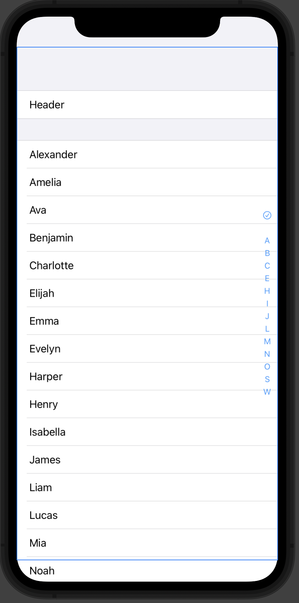

# TOC



````swift
var body: some View {
    List {
        Section {
            Text("Header").id("Header")
        }
        Section {
            ForEach(store.data) { d in
                Text(d.title).id(d.id)
            }
        }
    }.listStyle(GroupedListStyle())
    .toc {
        TOC.Item(.symbol("checkmark.circle"), id: "Header")
        TOC.Placeholder
        store
    }
}
````
